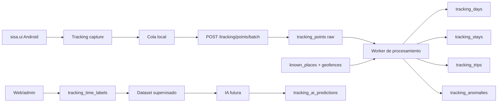

# Arquitectura minima y extensible para tracking e IA en SISA

## Estado y alcance

Este documento fija la arquitectura objetivo inicial para incorporar tracking de ubicacion, recorridos, permanencias, etiquetas temporales e IA futura en SISA sin reescribir la plataforma actual.

El alcance de esta etapa es discovery y diseno. No habilita implementacion todavia. Antes de escribir codigo deben cerrarse las decisiones bloqueantes documentadas en `docs/tracking-decision-checklist.md`.

## Lectura de la base actual

- `sisa.api` ya ofrece una base razonable para extender: autenticacion, permisos, modulos operativos, tests, scripts y documentacion.
- `sisa.api` ya tiene una implementacion parcial de tracking: `TrackingController`, `TrackingPolicies`, `UserTrackingAssignments`, `GpsPoints`, `GpsUploadBatches`, rutas `/tracking/policy`, `/tracking/points/batch`, `/tracking/status`, `/tracking/admin/*`, nearby clients/providers y `tests/Controllers/TrackingControllerTest.php`.
- `sisa.ui` ya tiene Expo 54, `expo-location`, `expo-task-manager`, permisos Android/iOS declarados, `TrackingContext`, `database/tracking.ts`, `src/tracking/location.ts` y pantallas bajo `app/tracking/*`.
- `sisa.web` existe como Vite/React 19 con `react-router-dom` y ya expone pantallas live de tracking administrativo en `TrackingCatalogsPages.tsx` contra `/tracking/admin/*` y endpoints de cercania.
- No existe un directorio raiz `sisa/` en el workspace revisado; por ahora no debe tratarse como repo de implementacion.
- La arquitectura debe aprovechar el monolito y el offline existente, no crear una plataforma paralela prematura.

La consecuencia cambia el enfoque: el primer trabajo no es crear tracking desde cero, sino endurecer lo existente para que cumpla los requisitos de campo, auditoria, multi-tenant, reconstruccion e IA futura.

## Decision arquitectonica

La recomendacion es evolucionar el modulo de tracking dentro del monolito actual, manteniendo la ingesta dedicada y agregando idempotencia mas fuerte, puntos crudos append-only con scope completo, procesamiento asincronico en el mismo codigo base, tablas derivadas reconstruibles y etiquetas manuales como verdad de negocio.

No se recomienda para el MVP:

- microservicio dedicado,
- Kafka/RabbitMQ,
- feature store,
- map-matching,
- dashboards de productividad,
- tracking garantizado con la app terminada,
- IA generativa o autoetiquetado definitivo.

## Componentes

| Componente | Responsabilidad |
|---|---|
| `sisa.ui` tracking capture | Pedir permisos, aplicar policy, capturar ubicacion foreground/background opt-in, guardar cola local y subir lotes |
| API tracking | Validar scope, permisos, device, company/member, idempotencia y persistir raw |
| Raw store | Guardar puntos y batches sin edicion destructiva |
| Worker tracking | Reconstruir dias, stays, trips, gaps, anomalias y quality score |
| Derived store | Exponer dias, rutas, timeline, stays, trips, labels y candidatos de lugares |
| Web/admin console | Revisar mapa diario, timeline, labels, lugares conocidos y auditoria |
| IA futura | Sugerir labels o anomalias sin pisar datos manuales |

## Flujo principal

## Captura movil

El MVP debe ser Android-first y honesto con las limitaciones de Expo/Android:

- soportar foreground fiable,
- soportar background opt-in mientras la app siga viva y el sistema no la haya terminado,
- no prometer tracking garantizado con app terminada,
- registrar estado de permisos, precision, bateria, app state y flags de confiabilidad,
- guardar cola local antes de enviar,
- subir por lotes idempotentes.

El task de background debe registrarse desde un modulo importado por la raiz de la app, no dentro de una pantalla aislada.

## Modelo de datos propuesto

Principios:

- `company_id` en todas las tablas relevantes.
- Raw append-only e inmutable para auditoria y reproceso.
- Derivados reconstruibles desde raw.
- Validacion referencial en aplicacion, alineada con la convencion actual sin foreign keys obligatorias.
- IA separada de labels manuales.

Tablas minimas:

| Tabla | Tipo | Proposito |
|---|---|---|
| `tracking_point_batches` | soporte raw | Idempotencia y auditoria de ingesta |
| `tracking_points` | raw | Puntos GPS crudos append-only |
| `tracking_days` | derivada | Agregado diario por miembro/dispositivo |
| `tracking_segments` | derivada | Tramos homogeneos del recorrido |
| `tracking_stays` | derivada | Permanencias detectadas |
| `tracking_trips` | derivada | Viajes entre stays |
| `known_places` | catalogo | Lugares conocidos por empresa |
| `known_place_geofences` | catalogo | Geocercas simples, circulos primero |
| `tracking_time_labels` | manual/derivada | Etiquetas sobre intervalos, stays, trips o dia |
| `tracking_label_types` | catalogo | Tipos configurables de etiqueta |
| `tracking_unknown_place_candidates` | derivada | Lugares recurrentes no conocidos |
| `tracking_anomalies` | derivada | Gaps, saltos imposibles, baja calidad |
| `tracking_ai_predictions` | IA | Predicciones separadas del dato manual |
| `tracking_processing_runs` | soporte | Corridas de reconstruccion/reproceso |
| `tracking_histories` | auditoria | Trazabilidad de cambios sensibles |

La base actual usa `gps_upload_batches` y `gps_points`. Puede evolucionarse en sitio si se agregan los campos faltantes, o migrarse a nombres `tracking_*` si se decide normalizar nomenclatura. La prioridad no es el nombre: es `company_id`, idempotencia por UUID, auditoria y derivados reconstruibles.

Brechas verificadas en la base actual:

- `gps_points` y `gps_upload_batches` no exponen `company_id` en el esquema revisado.
- La idempotencia actual descansa principalmente en `device_id + sequence_no`; falta contrato explicito de `batch_uuid` y `point_uuid`.
- No se observaron tablas derivadas de dias, stays, trips, labels, unknown places, processing runs ni AI predictions.
- El storage actual es MySQL via PDO, con `lat/lng` numericos e indices basicos; no hay evidencia de uso geoespacial nativo.

## Contratos API iniciales

| Metodo | Ruta | Objetivo |
|---|---|---|
| `GET` | `/tracking/policy` | Descargar politica activa de captura |
| `POST` | `/tracking/points/batch` | Ingesta dedicada de puntos GPS |
| `GET` | `/tracking/days` | Listar dias con datos por miembro/empresa |
| `GET` | `/tracking/timeline` | Obtener timeline diario |
| `GET` | `/tracking/route` | Obtener geometria simplificada del recorrido |
| `POST` | `/tracking/rebuild` | Recalcular dia o rango |
| `GET/POST/PUT/DELETE` | `/tracking/places` | CRUD de lugares conocidos |
| `GET/POST/PUT/DELETE` | `/tracking/label-types` | CRUD de tipos de etiqueta |
| `GET/POST/PUT/DELETE` | `/tracking/labels` | CRUD de etiquetas temporales |
| `GET` | `/tracking/unknown-places` | Revisar lugares recurrentes no mapeados |
| `GET` | `/tracking/audit` | Auditoria de consultas y cambios sensibles |

`/sync/batch` no debe usarse para puntos GPS crudos de alta frecuencia. Tracking necesita un carril dedicado.

## Reglas MVP sin IA

| Deteccion | Regla inicial configurable |
|---|---|
| Punto descartable para derivados | `accuracy_m > 250` o timestamp imposible |
| Baja confiabilidad | `accuracy_m > 100`, fuente pobre, skew alto o bateria extrema |
| Salto imposible | Velocidad calculada superior a 180-220 km/h |
| Stay | Puntos fiables dentro de 50-75 m durante 8-10 min |
| Trip | Movimiento sostenido o tramo entre dos stays |
| Gap | Ausencia de puntos mayor a 5 min en jornada activa |
| Fuera de horario | Timestamp fuera de policy activa |
| Match a lugar conocido | Centroide dentro de geofence prioritaria |
| Lugar desconocido recurrente | 3 o mas stays en 2 o mas dias dentro de 60 m |

## IA futura

La IA debe operar sobre derivados, labels humanos, features versionadas y datasets auditables. No debe reemplazar el raw ni pisar labels manuales.

Secuencia recomendada:

1. Reglas deterministas.
2. Clasificador tabular cuando existan labels suficientes.
3. LLM opcional para explicaciones o sugerencias textuales.
4. Modelos mas complejos solo si el volumen y la calidad lo justifican.

Guardar desde el dia uno:

- calidad del sensor,
- distancia, duracion y velocidad,
- contexto temporal,
- contexto espacial,
- secuencia stay-trip-stay,
- contexto operativo,
- correcciones humanas,
- versiones de reglas/features/modelos.

## Privacidad y gobernanza

Tracking de ubicacion puede convertirse en profiling laboral. Por eso el MVP debe incluir desde el inicio:

- policy explicita por empresa/miembro,
- permisos sensibles separados,
- masking fuera de horario para roles sin permiso elevado,
- auditoria de consultas y cambios,
- retencion definida,
- intervencion humana sobre cualquier sugerencia automatica,
- prohibicion inicial de scoring disciplinario o decisiones automaticas.

Retencion inicial sugerida:

- raw hot 90-180 dias,
- derivados y labels por mas tiempo segun politica,
- downsampling o archivado posterior,
- borrado selectivo por empresa/politica.

## Fases

| Fase | Alcance | Salida esperada |
|---|---|---|
| 1 | Policy, captura, ingesta raw | Endpoint batch, raw immutable, device metadata, idempotencia |
| 2 | Mapa y timeline read-only | Dias, ruta simplificada, gaps y puntos dudosos |
| 3 | Stays/trips/gaps v1 | Derivados reconstruibles con quality score |
| 4 | Etiquetado manual | Labels por intervalo/stay/trip y auditoria |
| 5 | Lugares conocidos | Geofences server-side y candidatos desconocidos |
| 6 | Dataset IA | Export, features versionadas y metricas |
| 7 | Automatizacion | Sugerencias no destructivas por reglas/IA |

## Validacion minima

- API: lotes validos, duplicados, out-of-order, clock skew, scope multi-tenant.
- Movil: modo avion, reintentos, kill/reopen, permisos, bateria.
- Worker: reconstruccion determinista del mismo dia con mismos inputs.
- Timeline: gaps, stays, trips y quality score sobre dataset manual.
- Labels: auditoria, supersession y coherencia entre revisores.
- Privacidad: permisos, masking, audit log y retencion.

## Riesgos principales

| Riesgo | Mitigacion |
|---|---|
| Bateria | Policy de frecuencia, piloto real y degradacion controlada |
| Permisos Android | UX educativa y flujo a Settings |
| App terminada | No prometer garantia closed-app con Expo actual |
| Duplicados/offline | Batch UUID + point UUID + ack parcial |
| Gaps de senal | Detectar huecos, no inventar continuidad |
| Volumen | Raw append-only, derivados diarios y simplificacion de polylines |
| Privacidad | Policy, masking, auditoria y retencion |
| IA prematura | Labels humanos primero; sugerencias no destructivas |
| Multi-tenant | `company_id` obligatorio y tests de aislamiento |
